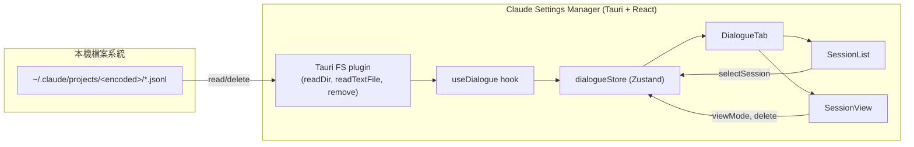
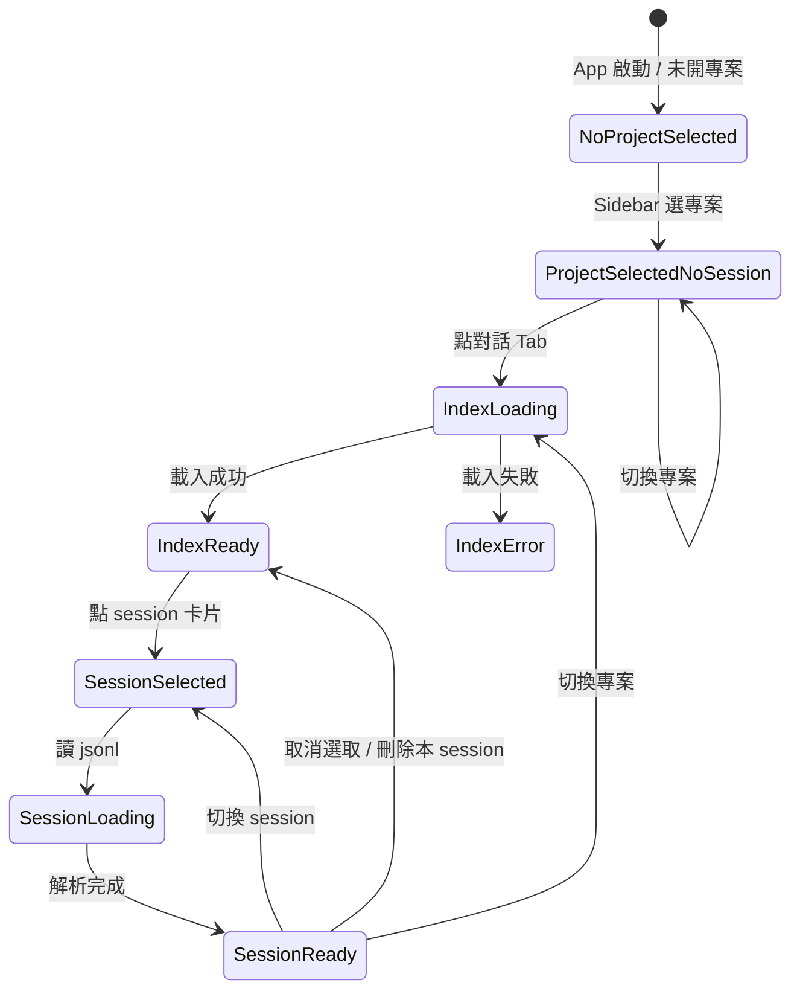

# Session History Viewer — Design Spec

**Date**: 2026-04-19
**Branch**: `feat/session-history-viewer`
**Author**: Kevin Tsai（與 Claude 協同設計）

## 背景與動機

Claude Code 會將每個專案的對話歷史存放在：

```text
~/.claude/projects/<encoded-project-path>/<sessionId>.jsonl
```

每個 `.jsonl` 檔是一個 session 的逐行事件流（user/assistant 訊息、工具呼叫、hook 附件、context compaction 摘要等）。目前這些紀錄只能手動翻檔查看，使用者無法在 Claude Settings Manager 這個 App 內快速回顧「這個專案曾經跟 Claude 聊過什麼」。

本功能新增一個「對話」Tab，讓使用者能在 App 內檢視當前選取專案的所有 session，並能切換不同顆粒度、搜尋、刪除。

## 需求總覽

| 項目 | 決定 |
|---|---|
| 入口 | TabBar 新增「對話」Tab |
| 專案來源 | 沿用 Sidebar `openProject`，以 store 的 `projectDir` 為準 |
| 未選專案 | Tab 內容顯示提示「← 請從左側選擇專案」 |
| Session 列表 | 依日期分組（今天 / 昨天 / 本週 / 更早），顯示時間、訊息數、首 prompt 摘要 |
| 對話顆粒度 | 預設「純對話」，可切換「對話+工具」/「完整原始」 |
| 搜尋 | 跨當前專案所有 session 的關鍵字搜尋（≥2 字、debounce 200ms） |
| 刪除 session | 提供按鈕，**需二次確認視窗** |
| 壓縮摘要 | 特殊樣式（虛線框 + 「Compaction Summary」標籤，預設摺疊） |
| Subagent | `isSidechain: true` 事件分組為可摺疊群組（紫色系區隔色） |
| 匯出 | 本期不做（YAGNI） |
| 效能 | 純前端解析；首次點 Tab 才載入；I/O 並行上限 8 |

## 架構選型

採「**方案 A：純前端解析 + 延遲讀取**」：
- 列表載入：掃描 `~/.claude/projects/<encoded>/`，逐檔讀 + 解析 metadata
- 展開 session：才讀該 jsonl 完整內容並快取
- 搜尋：逐檔掃描（命中字串即匹配），debounce + AbortController

**捨棄方案 B（Rust 側 command）**：違反此 repo「minimal Rust」原則、收益不明顯。
**捨棄方案 C（本地 index cache）**：當下規模（專案 <500 session × ~300KB）用不到，YAGNI。

## 系統脈絡圖



## 資料模型

### 新增型別（`src/types/dialogue.ts`）

```ts
/** 單一事件（jsonl 的一行） */
export interface DialogueEvent {
  uuid: string;
  timestamp: string;               // ISO 8601
  type: string;                    // "user" | "assistant" | "attachment" | "queue-operation" | ...
  sessionId: string;
  parentUuid?: string | null;
  isSidechain?: boolean;           // subagent 的事件 = true
  message?: {
    role?: 'user' | 'assistant';
    content: string | ContentBlock[];
  };
  isCompactSummary?: boolean;
  isVisibleInTranscriptOnly?: boolean;
  attachment?: {
    type: string;
    filename?: string;
    displayPath?: string;
    [k: string]: unknown;
  };
  raw: Record<string, unknown>;    // 原始 JSON，供 raw 模式完整顯示
}

/** Session 列表用的輕量 metadata */
export interface SessionMeta {
  sessionId: string;
  filePath: string;
  startTime: string;
  lastTime: string;
  messageCount: number;            // user + assistant 訊息數
  firstPromptPreview: string;      // 首則 user message 前 60 字
  hasCompaction: boolean;
  hasSubagent: boolean;            // 是否有 sidechain
  fileSize: number;                // byte
}

/** 某專案的 session 清單 */
export interface ProjectDialogueIndex {
  projectDir: string;              // 原始路徑（如 d:\GitHub\claude-settings）
  encodedDir: string;              // 編碼後（如 d--GitHub-claude-settings）
  folderPath: string;              // ~/.claude/projects/<encoded>/
  sessions: SessionMeta[];         // 依 lastTime 降冪
}

/** 顆粒度切換 */
export type DialogueViewMode = 'chat' | 'chat+tools' | 'raw';
```

### Zustand store（`src/store/dialogueStore.ts`）

```ts
interface DialogueState {
  indexByProject: Record<string, ProjectDialogueIndex>;   // cache: projectDir → index
  eventsBySession: Record<string, DialogueEvent[]>;       // cache: sessionId → parsed events
  selectedSessionId: string | null;
  viewMode: DialogueViewMode;                             // 預設 'chat'
  searchQuery: string;
  searchResults: {                                        // 搜尋命中快取
    sessionIds: string[];
    hitCount: number;
  } | null;
  loadingIndex: boolean;
  loadingSession: boolean;

  // actions
  setSelected(id: string | null): void;
  setViewMode(mode: DialogueViewMode): void;
  setSearchQuery(q: string): void;
  setProjectIndex(projectDir: string, index: ProjectDialogueIndex): void;
  setEvents(sessionId: string, events: DialogueEvent[]): void;
  removeSession(projectDir: string, sessionId: string): void;
  clearSelection(): void;
  clearSearch(): void;
}
```

## 檔案結構（新增與修改）

### 新增

```text
src/types/dialogue.ts                       型別定義
src/utils/pathEncoder.ts                    projectDir ↔ encodedDir 轉換
src/utils/jsonlParser.ts                    逐行解析、事件過濾、分組
src/hooks/useDialogue.ts                    載入/搜尋/刪除
src/store/dialogueStore.ts                  Zustand slice
src/components/tabs/DialogueTab.tsx         主 Tab 元件
src/components/dialogue/SessionList.tsx     左欄
src/components/dialogue/SessionView.tsx     右欄
src/components/dialogue/MessageBubble.tsx   訊息渲染（多變體）
src/components/dialogue/SubagentGroup.tsx   sidechain 摺疊群組
src/components/dialogue/DialogueTab.css     樣式
docs/superpowers/specs/2026-04-19-session-history-viewer-design.md  本設計文件
```

### 修改

```text
src/App.tsx                                 TAB_COMPONENTS 新增 'dialogue' 鍵
src/components/TabBar/TabBar.tsx            新增「對話」按鈕（lucide MessageSquare）
```

不需修改 `src-tauri/capabilities/default.json`（現有權限已完全涵蓋）。

## 關鍵流程

### 路徑編碼規則（`pathEncoder.ts`）

```ts
// d:\GitHub\claude-settings  →  d--GitHub-claude-settings
export const encodeProjectPath = (p: string) =>
  p.replace(/[\\/:]/g, '-').replace(/-+$/, '');
```

### Session 列表載入

1. 由 `projectDir` 算出 `encodedDir`，組出資料夾路徑
2. 檢查資料夾存在性；不存在 → 回空 index
3. `readDir` 取所有 `*.jsonl`（忽略子資料夾如 `tool-results/`）
4. 對每檔並行（pool=8）呼叫 `parseSessionMeta`：
   - 讀檔、逐行 `JSON.parse`（壞行跳過）
   - 計算 metadata（startTime、lastTime、messageCount、firstPromptPreview、hasCompaction、hasSubagent、fileSize）
5. 依 `lastTime` 降冪排序
6. 寫入 `dialogueStore.indexByProject[projectDir]`

### 單一 Session 載入（展開時）

1. 查 `eventsBySession[sessionId]` cache → 命中即回
2. `readTextFile(filePath)`
3. 逐行 parse → `DialogueEvent[]`（保留 `raw`）
4. 依 `timestamp` 升冪排序（並以 `parentUuid` 鏈修正亂序）
5. 寫入 cache
6. 渲染時依 `viewMode` 過濾：
   - `chat`：`type ∈ {user, assistant}` 且非 subagent tool event
   - `chat+tools`：chat + 可見的 tool_use / tool_result
   - `raw`：全部事件（含 queue-operation、attachment）

### 搜尋

1. 使用者輸入 → 清理（trim）+ ≥2 字 + debounce 200ms
2. 啟動新 `AbortController`（cancel 前一個任務）
3. 遍歷 `indexByProject[projectDir].sessions`：
   - 已快取 events → 在 cache 內比對
   - 未快取 → `readTextFile` + `indexOf` 快速比對（不完整解析）
4. 命中 session 加入結果；超過 500 筆停止並顯示「僅顯示前 500 筆」
5. SessionList 只顯示命中的 session；SessionView 打開時高亮命中訊息並自動捲到首個命中

### 刪除 Session（含二次確認）

1. 使用者點卡片右側垃圾桶 icon
2. 彈出 `<ConfirmDialog>`（沿用現有 UI 風格）
   - 標題：「刪除此對話紀錄？」
   - 內文：時間 + 首 prompt 摘要 + 檔案路徑
   - 警告：「此操作不可復原。若此 session 正由 Claude Code 寫入中，刪除可能造成異常。」
   - 按鈕：取消（預設聚焦） / 刪除（紅色危險色）
3. 確認 → 驗證 `filePath` 起始於 `$HOME/.claude/projects/`（防 path traversal） → `fs:remove`
4. 成功：從 store 移除該 meta；若此 session 當前被選取 → 清空 SessionView
5. 失敗：toast「刪除失敗：<錯誤訊息>」

### 切換 projectDir

```ts
useEffect(() => {
  dialogueStore.clearSelection();
  dialogueStore.clearSearch();
  if (activeTab === 'dialogue') loadProjectIndex();
}, [projectDir]);
```

其他 Tab 行為完全不變（本就各自透過 `useEffect([projectDir])` 連動）。

## UI 佈局

### DialogueTab 整體

```text
┌ DialogueTab ────────────────────────────────────────────────────┐
│ ┌ SessionList (340px) ─┐ ┌ SessionView (flex: 1) ──────────────┐ │
│ │ 🔍 搜尋對話…         │ │ 2026-04-18 14:32 · 47 則 · main 分支│ │
│ │ ─────────────────── │ │ [純對話 ▼] [🗑 刪除]                  │ │
│ │ 今天                 │ │ ──────────────────────────────────  │ │
│ │  ┌ 14:32 · 47 則 ┐  │ │  [user] 開一個分支規劃新功能…       │ │
│ │  │ 開一個分支… 🗑│  │ │  [assistant] 好，我先探索…          │ │
│ │  └───────────────┘  │ │  ▸ 🤖 Subagent (Explore)            │ │
│ │  ┌ 10:15 · 12 則 ┐  │ │  [tool-result] (subagent 回報)       │ │
│ │  │ …             │  │ │  ╔ Compaction Summary ══════════╗   │ │
│ │  └───────────────┘  │ │  ║ （摘要內容，預設折疊）         ║   │ │
│ │ 昨天 / 本週 / 更早   │ │  ╚════════════════════════════════╝ │ │
│ └──────────────────────┘ └──────────────────────────────────────┘ │
└─────────────────────────────────────────────────────────────────┘
```

### MessageBubble 變體

| 變體 | 視覺 | 判定 |
|---|---|---|
| `user` | 靠右，主色淡底 | `type === 'user'` 且無 `tool_result` |
| `assistant-text` | 靠左，灰底 | `assistant` message 的 text block |
| `assistant-thinking` | 灰底 + 斜體 + 可摺疊（預設收） | `content.type === 'thinking'` |
| `tool-use` | 等寬字、單色邊框卡（可摺疊） | `content.type === 'tool_use'` |
| `tool-result` | 小圓角方塊（摘要 + 展開） | `type === 'user'` 含 `tool_result` |
| `compaction` | 全寬、虛線框 + `⤵ Compaction Summary` 標題（預設摺疊） | `isCompactSummary === true` |
| `attachment` | 小橫條（filename + path） | `type === 'attachment'` |
| `subagent-group` | 紫色左邊條 + `🤖 Subagent` header（預設摺疊） | 連續 `isSidechain: true` 聚合 |
| `raw-event` | 等寬字 JSON 語法高亮 | `viewMode === 'raw'` |

### Subagent 群組行為

- **分組判定**：連續 `isSidechain: true` 的 events 歸為一組；群組 header 從其首事件的父節點（主 agent 的 `tool_use`，通常是 Task 呼叫）取出 `subagent_type` 當標題
- **模式行為**：
  - `chat` / `chat+tools`：**顯示但預設摺疊**（header 可見：「🤖 Subagent (xxx) · N 則 · 耗時」）
  - `raw`：平鋪所有事件（不分組）
- **視覺**：紫色左邊條（`#8b5cf6` 系）+ 淡紫 header 底色

## 狀態圖（Session 檢視）



## 錯誤處理與邊界情況

| 情境 | 處理 |
|---|---|
| 未選專案 | 置中提示「← 請從左側選擇專案」 |
| 專案資料夾不存在 | 「此專案尚無對話紀錄。當你在此目錄啟動 `claude` 後會自動出現。」 |
| 資料夾 0 個 jsonl | 同上 |
| 某行 JSON 壞掉 | 靜默跳過；`raw` 模式顯示「⚠ 無法解析的事件」 |
| 檔案被鎖（Windows） | toast「此對話正在使用中，請稍後再試」 |
| 刪除時檔案被鎖 | 同上 toast，操作失敗但 UI 不中斷 |
| 搜尋結果 >500 | 截斷 + 頂部提示「僅顯示前 500 筆」 |
| 單則訊息 >50KB | 顯示前 ~8KB + 「顯示完整內容」按鈕 |
| timestamp 異常 | 降級顯示原字串 |
| 搜尋中途切 projectDir | AbortController cancel，清空結果 |
| filePath 不在 `$HOME/.claude/projects/` | 拒絕刪除（防 path traversal） |

## 效能考量

- **並行 I/O 上限 8**：用手寫 pool，避免 Windows file handle 爆量
- **React.memo**：SessionList 分組卡片避免搜尋輸入時重算
- **key**：訊息列 key 用 `event.uuid`（jsonl 本就全域唯一）
- **虛擬捲動**：本期不做；若遇到單一 session >500 則訊息再回頭優化
- **Cache**：`eventsBySession` 記憶體 cache；切換 projectDir 時 clear（避免跨專案殘留）

## 測試策略

此 repo 目前未配置測試框架。手動驗證：
1. 空專案（從未用過 `claude`）— 顯示提示文字
2. 有對話的專案 — session 列表正確分組、排序
3. 點卡片展開 — 完整對話出現
4. 切 `純對話 / 對話+工具 / 完整原始` — 內容正確過濾
5. 搜尋「特定字串」— 命中 session 高亮、訊息跳轉
6. 含 compaction 的 session — 摘要以虛線框呈現、可摺疊
7. 含 subagent 的 session — 紫色群組摺疊、展開後可見內部對話
8. 刪除 session — 二次確認後檔案消失、UI 同步更新
9. 切換專案 — 對話 Tab 內容立即替換、其他 Tab 正常
10. 跨平台：Windows（`d:\...`）、macOS（`/Users/...`）的編碼規則都正確

## 範圍外（YAGNI，後續可增）

- 匯出為 Markdown
- 跨專案全域搜尋
- 虛擬捲動
- 本地 index cache（方案 C）
- session 排序切換（時間、檔案大小、訊息數）
- session rename / tag
- 對話內容的 markdown 渲染（本期僅以純文字顯示訊息內容）

## 里程碑

1. 型別 + 工具（`dialogue.ts`、`pathEncoder.ts`、`jsonlParser.ts`）
2. Store + Hook（`dialogueStore.ts`、`useDialogue.ts`）
3. 基礎 UI 骨架（`DialogueTab.tsx`、`SessionList.tsx`、`SessionView.tsx` + 串接 TabBar）
4. `MessageBubble` 所有變體
5. `SubagentGroup` + compaction 特殊樣式
6. 搜尋 + 刪除（含 ConfirmDialog）
7. 手動驗證清單走一遍
8. Release notes / CHANGELOG 補上新功能條目
